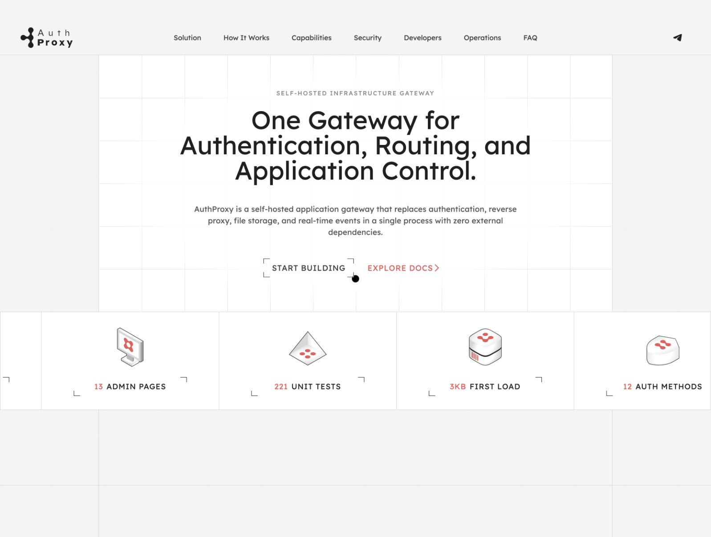

# AuthProxy · Landing Page

Статический лендинг AuthProxy на HTML, CSS и JavaScript. Этот репозиторий содержит сайт продукта, а не серверную часть AuthProxy.

- **Сайт:** [cr8v-studio.github.io/AuthProxy_dev](https://cr8v-studio.github.io/AuthProxy_dev/)
- **Репозиторий:** [cr8v-studio/AuthProxy_dev](https://github.com/cr8v-studio/AuthProxy_dev)
- **Деплой:** [GitHub Actions](https://github.com/cr8v-studio/AuthProxy_dev/actions/workflows/deploy-pages.yml), автоматически из `main` в GitHub Pages.

[](https://cr8v-studio.github.io/AuthProxy_dev/)

*Актуальная версия сайта · сентябрь 2026*

## Передача разработчикам — 27 сентября 2026

Завершены адаптация мобильной версии, исправление навигации, добавление футера и согласованные визуальные правки. Сохранены существующие стек, визуальный стиль, компоненты и анимации.

### Обновите рабочую копию перед началом работы

Для дальнейшей разработки используйте свежий клон актуальной `main` в новой папке:

```bash
git clone https://github.com/cr8v-studio/AuthProxy_dev.git AuthProxy_dev-current
cd AuthProxy_dev-current
git config --local core.hooksPath .githooks
```

Старую рабочую папку сохраните, пока не перенесены все незавершённые изменения. Не объединяйте прежние ветки с актуальной `main`: нужные правки переносите отдельными проверенными патчами, а новые ветки создавайте от свежей `main`.

### Что изменено

**Адаптивность и мобильная версия**

- Меню сворачивается при ширине менее 1200 px; открытое меню прокручивается в пределах экрана. На компактном десктопе скорректированы интервалы навигации.
- Высота первого экрана зависит от содержимого. Исправлены переполнения и переносы текста на узких экранах.
- `Start Building` и `Explore Docs` стоят в один ряд в первом и последнем блоках, включая ширину 320 px. Минимальная высота кнопок — 44 px.
- Метрики `12 / 13 / 221 / 3KB` показываются непрерывной бегущей строкой: две ширины карточки ниже 1200 px, четыре — на десктопе. Движение приостанавливается при наведении, фокусе, касании, уходе блока за экран и скрытии вкладки. При `prefers-reduced-motion` доступна обычная горизонтальная прокрутка.
- На телефонах убраны декоративные уголки метрик и карточек Solution, нижний левый уголок слайдов Security и четыре внешних уголка последнего CTA. Уголки кнопки `Start Building` сохранены.
- Иллюстрация стека Solution полностью помещается в свой блок: верхний APG с орбитой и нижний Admin Panel больше не обрезаются.
- Схема How It Works на телефонах выстраивается вертикально; иллюстрация Operations масштабируется по контейнеру.
- Слайдер Security имеет пять позиций с одной карточкой ниже 1200 px и четыре позиции с двумя карточками на десктопе. Скрытые слайды исключены из взаимодействия через `inert`, навигационные кнопки имеют область нажатия 44 px.
- Превью интерфейсов в финальном блоке можно горизонтально прокручивать на телефоне.

**Навигация, ссылки и футер**

- Исправлены три ссылки документации с ответом 404 и девять неверных якорей в документации.
- Ссылки на возможности продукта переключают соответствующий пункт Capabilities; выбор сохраняется при загрузке страницы по прямой ссылке с фрагментом.
- Исправлен запуск анимаций при открытии глубоких ссылок и восстановлении позиции прокрутки.
- Добавлен адаптивный футер: Product, Developers, Resources, Company, публичные контакты, юридические ссылки, текущий год и возврат наверх. На телефонах колонки располагаются сеткой 2×2.
- Полностью удалён раздел **Pricing**, включая тарифы, `What’s free forever` и ссылки в меню и футере. После Operations идёт FAQ.

**Анимации и публикация**

- Устранены предупреждения GSAP при масштабировании hover-элементов: используются отдельные `scaleX` и `scaleY`.
- Удалена инициализация анимации отсутствующего Pricing.
- Обновлены версии CSS и motion JS в URL подключения, чтобы браузеры загружали новые файлы.
- Настроена публикация через GitHub Actions → GitHub Pages; опубликованные HTML, CSS и motion JS сверены с локальной версией.

**Репозиторий и передача проекта**

- README дополнен обзором изменений, превью сайта, инструкциями запуска и картой файлов для разработчиков.
- Добавлены локальная проверка перед коммитом и обязательная проверка репозитория перед публикацией.
- Pages-артефакт содержит только файлы, необходимые сайту; документация и служебные инструменты хранятся отдельно.
- Актуальная база разработки — ветка `main`. Порядок обновления рабочей копии приведён выше.

### Что проверено

На дату передачи:

- Адаптивная компоновка проверена в браузере на ширинах от 320 до 1440 px. Последняя проверка: 320, 390, 768, 809, 810, 1200 и 1440 px — горизонтальное переполнение отсутствует, обе пары CTA стоят в ряд.
- Проверены мобильное меню, переход к FAQ, глубокие ссылки Capabilities, все пять слайдов Security, движение и паузы метрик, прокрутка метрик при отключённой анимации.
- После удаления Pricing проверены все 18 внутренних ссылок и 110 локальных подключений через `src`; отсутствующих целей и файлов нет, ID уникальны. Внешние адреса и фрагменты документации проверены в рамках первоначального аудита.
- Проверки синтаксиса обоих JS-файлов, статический motion smoke-check и `git diff --check` прошли.
- На опубликованной версии отсутствуют Pricing и ошибки/предупреждения в консоли. [GitHub Actions](https://github.com/cr8v-studio/AuthProxy_dev/actions) завершился успешно.

Это проверки браузерных размеров окна, а не сертификация на всех физических устройствах. Перед следующими релизами желательно отдельно проходить iOS Safari и Android Chrome.

## Локальный запуск

Сборка и установка npm-пакетов не нужны. Из корня репозитория запустите HTTP-сервер:

```bash
python3 -m http.server 8080 --bind 127.0.0.1
```

Откройте [http://127.0.0.1:8080](http://127.0.0.1:8080). Для проверки модулей и анимаций используйте HTTP, а не открытие `index.html` через `file://`.

Сайт загружает Google Fonts, GSAP 3.12.7 / ScrollTrigger и Lenis 1.3.11 с CDN. Для их работы требуется доступ к интернету; отсутствие этапа сборки не означает отсутствие внешних runtime-зависимостей.

## Структура и точки входа

| Путь | Назначение |
| --- | --- |
| `index.html` | Разметка всех секций, навигация, футер, URL подключений CSS/JS |
| `styles/site.css` | Компоновка секций и основные адаптивные правила |
| `styles/main.css`, `tokens.css`, `typography.css`, `components.css`, `icons.css` | Импорты, токены, типографика, общие компоненты и иконки |
| `scripts/site.js` | Меню и базовая интерактивность страницы |
| `assets/motion/animations.js` | GSAP/Lenis, прокрутка, карусели, эффекты и обработка reduced motion |
| `assets/` | Логотипы, SVG, изображения и прочие визуальные ресурсы |
| `scripts/motion_smoke_check.py` | Статическая проверка связности разметки и motion runtime |
| `.github/workflows/deploy-pages.yml` | Публикация статических файлов на GitHub Pages |

Навигация: **Solution → How It Works → Capabilities → Security → Developers → Operations → FAQ**. Затем идут финальный CTA и футер.

## Правила дальнейших изменений

- [LANDING-AUTHPROXY.md](./docs/LANDING-AUTHPROXY.md) — источник истины для структуры и текстов. Сначала обновляйте его, затем разметку.
- [responsive-playbook.md](./docs/responsive-playbook.md) — адаптивные правила: телефон 320–809 px, планшет 810–1199 px, десктоп от 1200 px.
- [AUTHPROXY-SKILL.md](./docs/AUTHPROXY-SKILL.md) — рабочий стандарт внесения изменений.
- [component-inventory.md](./docs/component-inventory.md) — активные и резервные компоненты. Не удаляйте резервные стили и ассеты без проверки использования.
- [motion-smoke-check.md](./docs/motion-smoke-check.md) — ручная проверка анимаций после загрузки.
- [BASELINE-VISUAL-2026-04-08.md](./docs/BASELINE-VISUAL-2026-04-08.md) — историческая визуальная база отдельных секций; актуальные согласованные мобильные изменения описаны в responsive-playbook.
- `docs/archive/` — исторические материалы, не актуальная спецификация сайта.

Сохраняйте относительные пути `./…`: сайт размещается в подпути `/AuthProxy_dev/`. При обновлении CSS/JS повышайте соответствующий параметр `?v=` в `index.html`. Не возвращайте Pricing через старые документы или оставшиеся резервные стили/ассеты.

### Проверки перед публикацией

Для проверки синтаксиса нужен установленный Node.js, для smoke-check — Python 3:

```bash
node --check scripts/site.js
node --check assets/motion/animations.js
python3 scripts/motion_smoke_check.py
python3 scripts/privacy_check.py
git diff --check
```

Smoke-check проверяет наличие селекторов и инициализаторов; он не заменяет браузерную проверку. После изменений проверяйте меню, якоря, CTA, карусели, переполнение, консоль и режим уменьшенного движения, включая границы 809/810 и 1199/1200 px.

## Публикация

В `Settings → Pages → Build and deployment` уже выбран источник **GitHub Actions**. Push в `main` запускает [deploy-pages.yml](./.github/workflows/deploy-pages.yml); доступен и ручной запуск через `workflow_dispatch`.

Workflow выполняет обязательную проверку репозитория, затем публикует только `index.html`, `assets/`, `styles/` и `scripts/site.js`. Документация и служебные скрипты не входят в Pages-артефакт. Остальные проверки выполняйте до push. После публикации дождитесь успешного Actions run и проверьте [живой сайт](https://cr8v-studio.github.io/AuthProxy_dev/).

## Возможные следующие улучшения

Не входят в завершённые правки и не блокируют передачу:

- Дополнить CI проверками внутренних ссылок и motion smoke-check.
- Добавить браузерные регрессионные проверки ключевых ширин, меню и глубоких ссылок.
- Измерить Lighthouse / Core Web Vitals на мобильном устройстве и по результатам оптимизировать загрузку изображений, шрифтов и анимаций.

## Настройка Git для разработки

Перед первым коммитом укажите своё имя и GitHub noreply-адрес из `Settings → Emails`, заменив значения в угловых скобках:

```bash
git config --local user.name "<GitHub username>"
git config --local user.email "<GitHub noreply address>"
git config --local user.useConfigOnly true
git config --local core.hooksPath .githooks
```

Локальный hook проверяет подготовленные изменения до коммита. Проверка в CI обязательна перед публикацией; не отключайте её при внесении новых правок.
